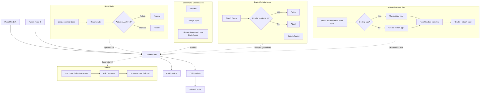

```mermaid
flowchart TB

    P1[Parent Node A]
    P2[Parent Node B]

    N[Current Node]

    C1[Child Node A]
    C2[Child Node B]
    GC[Sub-sub Node]

    P1 --> N
    P2 --> N
    N --> C1
    N --> C2
    C2 --> GC

    subgraph State["Node State"]
        S1[Load persisted Node]
        S2[Reconstitute]
        S3{Active or Archived?}
        S4[Archive]
        S5[Restore]

        S1 --> S2 --> S3
        S3 -->|Active| S4
        S3 -->|Archived| S5
    end

    subgraph Identity["Identity and Classification"]
        I1[Rename]
        I2[Change Type]
        I3[Change Requested Sub-Node Types]
    end

    subgraph Relationships["Parent Relationships"]
        R1[Attach Parent]
        R2{Circular relationship?}
        R3[Reject]
        R4[Attach]
        R5[Detach Parent]

        R1 --> R2
        R2 -->|Yes| R3
        R2 -->|No| R4
    end

    subgraph Content["Content"]
        D1[Load Description Document]
        D2[Edit Document]
        D3[Preserve DescriptionId]

        D1 --> D2 --> D3
    end

    subgraph SubNode["Sub-Node Interaction"]
        SN1[Select requested sub-node type]
        SN2{Existing type?}
        SN3[Use existing type]
        SN4[Create custom type]
        SN5[NodeCreation workflow]
        SN6[Create + attach child]

        SN1 --> SN2
        SN2 -->|Yes| SN3
        SN2 -->|No| SN4
        SN3 --> SN5
        SN4 --> SN5
        SN5 --> SN6
    end

    State -. operates on .-> N
    Identity -. modifies .-> N
    Relationships -. changes graph links .-> N
    N -. DescriptionId .-> Content
    SubNode -. creates child from .-> N
```