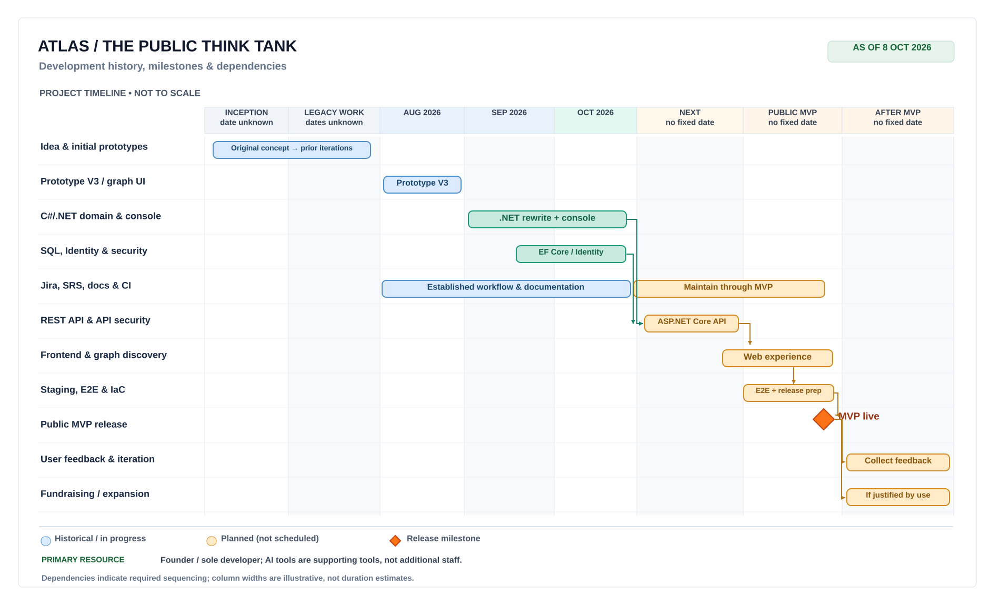

# Atlas milestone timeline

This is a **living, milestone-oriented roadmap** for Atlas: The Public Think Tank. It shows the project's history, current development work, key dependencies, and an indicative route toward a public MVP and later growth.

- [Open the editable Excalidraw timeline](atlas_milestone_timeline.excalidraw) — download or open this file in [Excalidraw](https://excalidraw.com/) to edit the shapes, labels, and dependencies.
- [View the SVG preview](atlas_milestone_timeline.svg) — a lightweight, GitHub-renderable reference. Update it when the Excalidraw source changes.

## How to read the timeline

- **Historical or in-progress work** includes the original idea, prior prototypes, the August 2026 prototype work, and the C#/.NET rewrite and supporting SQL Server, Identity, security, documentation, Jira, and CI work in September–October 2026.
- **Planned work** includes an ASP.NET Core REST API, web frontend and graph discovery, infrastructure as code, a staging environment, end-to-end testing, and preparation for a public MVP.
- **Milestones** include the public MVP release, subsequent user feedback, and potential fundraising and expansion.
- **Dependencies** communicate meaningful ordering: the API provides a foundation for the web experience; the release requires a working end-to-end experience and adequate deployment, security, and testing readiness. Development, documentation, and testing continue across multiple stages rather than ending at a single boundary.

This is **not a date-scaled Gantt chart**. Historical and near-term work is shown with more detail, while future periods are compressed. No due date or duration is implied by a bar's width. The inception date and earlier development periods are not yet verified; they are deliberately labeled as unknown. Planned work is **not a commitment to scheduled release dates**.

## People and resource assumptions

The primary labor resource is the founder's own development time, applied at a sustainable pace. AI-assisted tools, established frameworks, GitHub, Jira, and CI increase productivity but are not additional staff. Expanded hosting, moderators, or other contributors may become necessary after actual usage provides evidence of demand.

## Maintenance

Treat this drawing as a high-level companion to the more detailed Jira backlog and [requirements documentation](requirements/README.md), not as a replacement for them. When editing the roadmap:

1. Update the `.excalidraw` source first, then regenerate the SVG preview.
2. Distinguish completed work from in-progress and proposed work.
3. Add dates to the historical section only when verified.
4. Reflect major dependency or milestone changes without manufacturing precise estimates.

The roadmap represents a **planning hypothesis**, subject to revision as implementation and user feedback change priorities.
