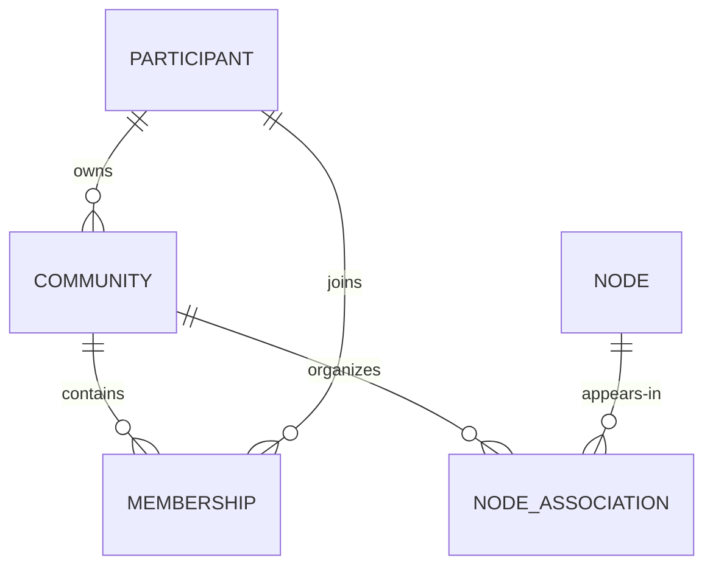

# Communities bounded context

[Domain implementation](../../src/Atlas.Communities/README.md) · [Requirements](../requirements/REQUIREMENTS.md#communities) · [Workflow](../workflows/COMMUNITIES.md)

Communities gives Atlas an optional organizational and discovery layer over Nodes. A Community is public/open in the first implementation. Its creator owns its metadata and lifecycle; eligible participants can view, join, leave, and associate appropriate Nodes.

## Relationships

The two many-to-many relationships are maintained through Community-owned records. `NODE_ASSOCIATION` does not change a Node or its Graph parents.

## Consistency and failures

The prototype uses one JSON file per owned record type. Repository-wide services enforce name uniqueness and association policies, but JSON provides only single-process consistency. A future database must enforce unique normalized Community names, `(CommunityId, ParticipantId)`, and `(CommunityId, NodeId)` constraints.

References may temporarily point to missing Participants or Nodes because cross-boundary transactions do not exist. Console composition displays missing references safely. Deletion is not implemented; archive preserves references.

## Follow-up decisions

- Ownership transfer and the owner's membership lifecycle.
- Removal or suspension of members.
- Community rules and presentation settings.
- Private/restricted discovery and invitation behavior if users request it.
- Versioned events for creation, archive, membership, and node-association changes.
- Durable uniqueness and concurrency enforcement during SQL migration.
