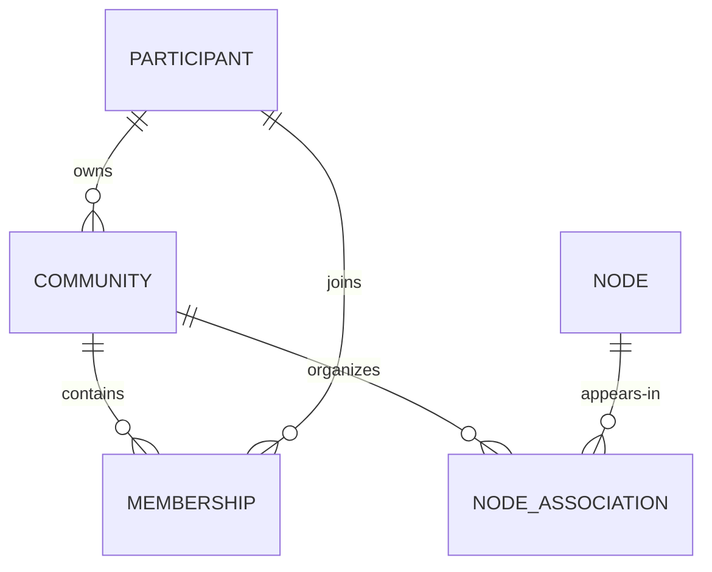

# Communities bounded context

[Domain implementation](../../src/Atlas.Communities/README.md) · [Requirements](../requirements/REQUIREMENTS.md#communities) · [Workflow](../workflows/COMMUNITIES.md)

Communities gives Atlas an optional organizational and discovery layer over Nodes. A Community is public/open in the first implementation. Its creator owns its metadata and lifecycle; eligible participants can view, join, leave, and associate appropriate Nodes.

## Relationships

```mermaid
erDiagram
    COMMUNITY ||--o{ MEMBERSHIP : contains
    PARTICIPANT ||--o{ MEMBERSHIP : joins
    COMMUNITY ||--o{ NODE_ASSOCIATION : organizes
    NODE ||--o{ NODE_ASSOCIATION : appears-in
    PARTICIPANT ||--o{ COMMUNITY : owns
```

The two many-to-many relationships are maintained through Community-owned records. `NODE_ASSOCIATION` does not change a Node or its Graph parents.

## Consistency and failures

The Console supplies SQL repository adapters for CommunityRows, CommunityMembershipRows, and CommunityNodeRows. SQL Server enforces a unique Community Name index and composite primary keys for (CommunityId, ParticipantId) and (CommunityId, NodeId). Name comparison follows the database collation; application validation also checks names case-insensitively.

Foreign keys enforce references to existing Communities, Participants, and Nodes. NoAction prevents physical deletion while dependents exist; archive preserves references. Each repository save is transactional, but creating a Community plus its initial membership and other multi-save workflows do not share one transaction. Conflicting edits of the same row currently use last-write behavior.

## Follow-up decisions

- Ownership transfer and the owner's membership lifecycle.
- Removal or suspension of members.
- Community rules and presentation settings.
- Private/restricted discovery and invitation behavior if users request it.
- Versioned events for creation, archive, membership, and node-association changes.
- Recovery/transactions for multi-record workflows and conflict handling for simultaneous edits.
