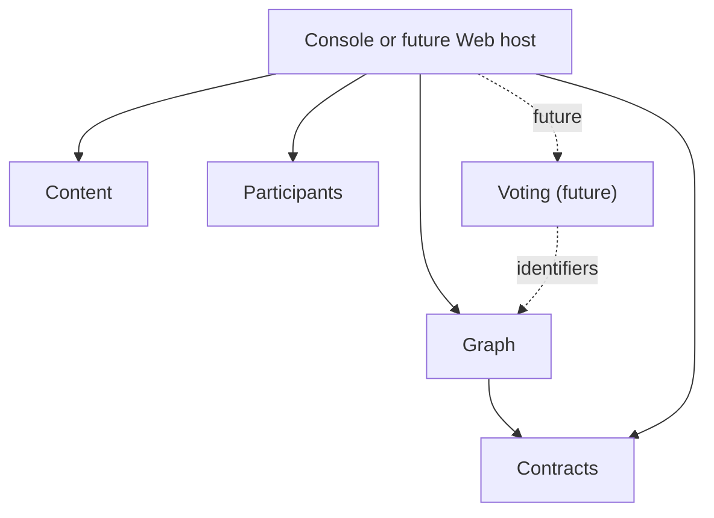

# Atlas bounded-context map

This map describes ownership and communication direction. It is not a class dependency diagram.

## Boundary responsibilities

| Boundary | Owns | References | Does not own |
|---|---|---|---|
| Graph | Nodes, node types, requested sub-node types, parent relationships, node lifecycle | Participant IDs, description/document IDs | Profiles, documents, votes |
| Content | Documents, document IDs, future content blocks and ordering | External resource IDs when required | Nodes, profiles, voting rules |
| Participants | Participant IDs, public profiles, participant lifecycle, profile-update policy | Nothing from Graph for its core model | Nodes, documents, credentials |
| Contracts | Versioned cross-boundary payload shapes | Primitive wire values | Domain behavior or persistence |
| Voting — future | Ballots, rating scales, eligibility, aggregates | Node and participant identifiers | Nodes, profiles, documents |
| Console | Composition, interaction, JSON adapters, demonstration event bus | Public APIs from all current boundaries | Domain invariants |

## Relationship styles

| Relationship | Current form | Intended boundary rule |
|---|---|---|
| Console → Graph | Direct project call | Call Graph application/domain API |
| Console → Content | Direct project call | Call Content application API |
| Console → Participants | Public use-case call | Authorization remains inside Participants |
| Graph → Contracts | Records versioned event contracts | Do not publish Graph entities |
| Content observes Graph | Console-registered event handler | Consumer chooses whether to react |
| Graph ↔ Participants | Shared primitive GUID meaning | Do not share Participant or Node objects |

## Important distinctions

A node's `AuthorId` identifies an author but does not copy the Participant. A node's `DescriptionId` identifies a document but does not copy the Document. The host may combine these records into one screen model without changing who owns them.

See [Data ownership](DATA-OWNERSHIP.md) for authoritative records and [ADRs](decisions/README.md) for the reasoning behind these choices.
