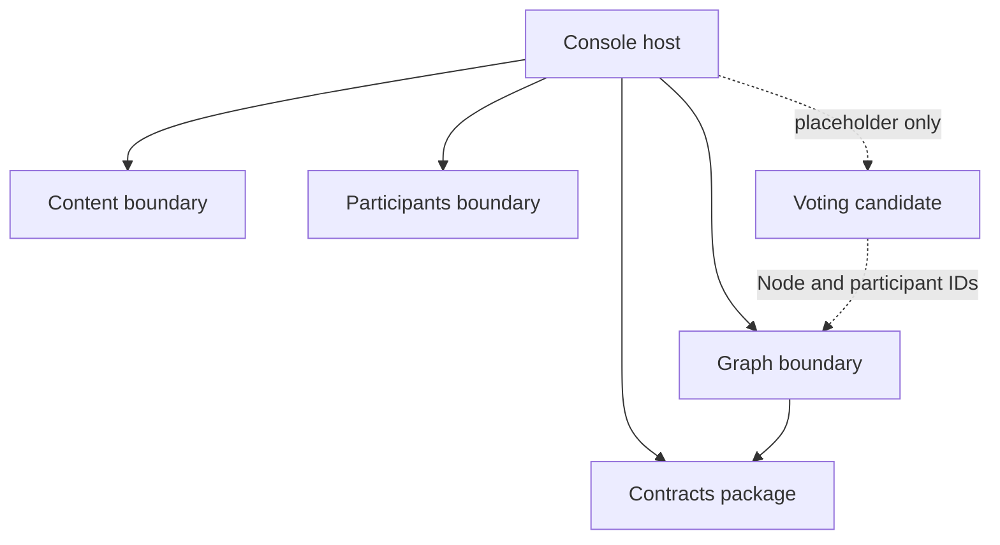
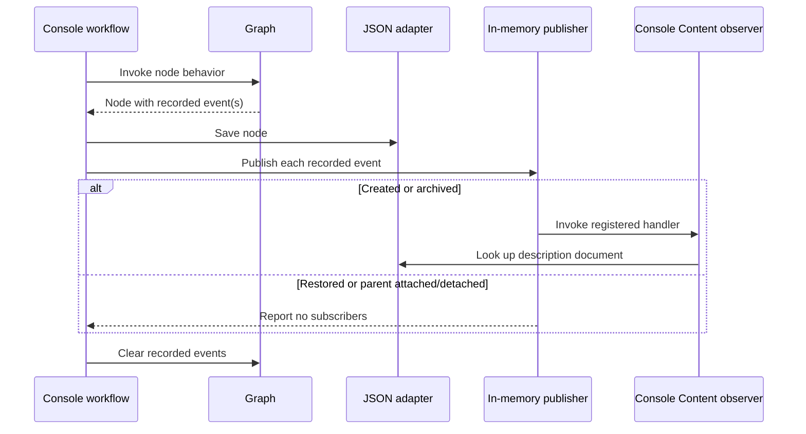

# Atlas current-state context map

This document is the authoritative inventory of Atlas boundaries, ownership, and communication as implemented today. It records evidence and gaps; it does not design the future architecture.

`Graph`, `Content`, and `Participants` are domain boundaries. `Contracts` is a shared integration-contract package, and `Console` is the current host/composition root. They appear together because all five participate in the running prototype, not because they are the same kind of architectural component.

## Current topology

Solid arrows are implemented project references or calls. Dashed arrows are documented candidates with no implemented boundary.

The final dashed relationship is documented intent, not a claim that Voting exists or that its design is settled.

## Boundary coverage matrix

A wide matrix is difficult to use on a phone. The same coverage fields are
therefore presented as a consistent two-column table for each component. The
repeated field order preserves comparison while allowing the text column to use
the available screen width.

“References” means an ID or public API used across an ownership boundary.
Repository interfaces belong to the domain that defines its persistence needs;
the JSON implementations belong to the Console host.

### Graph

| Attribute | Current state |
|---|---|
| **Kind** | Domain boundary |
| **Responsibility** | Model typed nodes and the directed parent graph. |
| **Implemented behaviors** | Create and reconstitute nodes. Rename, change type, and replace description references. Archive and restore. Request response types. Attach and detach parents. Create, edit, and archive node types. Enforce local invariants. |
| **Owns** | Nodes and node IDs. Node types and requested sub-node types. Parent IDs on the child. Graph lifecycle state. |
| **References** | `NodeAuthorId` corresponding to a Participant ID. `NodeDescriptionId` corresponding to a Document ID. Contracts event records. |
| **Does not own** | Profiles and credentials. Documents. Votes. JSON persistence. |
| **Publishes** | Records `NodeCreatedV1`, `NodeArchivedV1`, `NodeRestoredV1`, `NodeParentAttachedV1`, and `NodeParentDetachedV1` on `Node`. |
| **Subscribes** | None. |
| **Documentation** | [Graph README](../../src/Atlas.Graph/README.md) [Requirements](../requirements/REQUIREMENTS.md) [RTM](../requirements/TRACEABILITY.md) ADRs 1–3 |
| **Gaps or open questions** | Cycle prevention and default Comment policy are host-local. Most node mutations lack authorization. Relationship-node minimum-parent rules are not enforced. Global type-name uniqueness is host-local. Several mutations have no events. Graph directly references Contracts; the desired long-term dependency direction remains open. |

### Content

| Attribute | Current state |
|---|---|
| **Kind** | Domain boundary |
| **Responsibility** | Hold separately identified description documents. |
| **Implemented behaviors** | Create and reconstitute a document. Normalize initial document text. Define document repository needs. |
| **Owns** | Documents and document IDs. Document text and creation time. |
| **References** | No foreign IDs in the current model. |
| **Does not own** | Nodes. Profiles. Votes. Event dispatch. JSON persistence. |
| **Publishes** | None. |
| **Subscribes** | None inside `Atlas.Content`. A Console-owned observer is registered for `NodeCreatedV1` and `NodeArchivedV1` and queries the Content repository. |
| **Documentation** | [Data ownership](DATA-OWNERSHIP.md) [Node lifecycle workflow](../workflows/NODE-LIFECYCLE.md) CON requirements and RTM rows |
| **Gaps or open questions** | No document-edit behavior or updated timestamp. No Content tests or application use case. The observer's placement makes Content subscription structurally ambiguous. Creation can leave an orphaned document. |

### Participants

| Attribute | Current state |
|---|---|
| **Kind** | Domain boundary |
| **Responsibility** | Model public participant profiles and profile lifecycle. |
| **Implemented behaviors** | Create and reconstitute participants. Update an owner's display name and bio through an authorized use case. Deactivate participants. Define participant repository needs. |
| **Owns** | Participant IDs. Display name and bio. Active state and timestamps. Self-edit policy. |
| **References** | Nothing from Graph in its core model. |
| **Does not own** | Nodes and authored contributions. Credentials and login tokens. Documents. Graph authorization rules. JSON persistence. |
| **Publishes** | None. |
| **Subscribes** | None. |
| **Documentation** | [Participants README](../../src/Atlas.Participants/README.md) PAR/AUT requirements and RTM rows |
| **Gaps or open questions** | Deactivation lacks an authorized use case. Reactivation and moderator policy are undefined. No lifecycle events. Profile browsing and contribution composition live in Console. |

### Contracts

| Attribute | Current state |
|---|---|
| **Kind** | Shared contract package |
| **Responsibility** | Supply versioned payload types for cross-boundary messages. |
| **Implemented behaviors** | Define Graph V1 lifecycle record shapes. |
| **Owns** | Payload definitions. Version namespaces. |
| **References** | Primitive wire values supplied by Graph. |
| **Does not own** | Domain rules and entities. Event dispatch. Persistence. Consumer reactions. |
| **Publishes** | None by itself. |
| **Subscribes** | None. |
| **Documentation** | [Contracts catalog](../contracts/README.md) [ADR-0003](decisions/ADR-0003-use-versioned-integration-contracts.md) |
| **Gaps or open questions** | No serialization compatibility tests. No event ID, correlation, or causation metadata. The package is described beside bounded contexts although it is not a domain boundary. |

### Console

| Attribute | Current state |
|---|---|
| **Kind** | Host and composition root |
| **Responsibility** | Compose workflows and reads; provide the UI, session actor, persistence adapters, seeding, and synchronous event dispatch. |
| **Implemented behaviors** | Create and browse participants and nodes. Edit profiles. Compose author, document, and type data for display. Check graph cycles. Seed system types. Save JSON. Register and dispatch event handlers. |
| **Owns** | Current-participant session state. Host workflow sequencing. User interface. JSON adapter implementations. In-memory subscriber registry. |
| **References** | Public APIs and repository contracts from all implemented boundaries. Contracts payloads. |
| **Does not own** | Domain invariants. Nodes, documents, and profiles. Contract meanings. |
| **Publishes or dispatches** | Dispatches Graph-recorded events after saves; it is not the semantic producer. |
| **Subscribes** | Registers its Content observer for `NodeCreatedV1` and `NodeArchivedV1`. |
| **Documentation** | [Console README](../../src/Atlas.Console/README.md) [Node lifecycle workflow](../workflows/NODE-LIFECYCLE.md) EVT/PER requirements and RTM rows |
| **Gaps or open questions** | Some policies may belong behind boundary APIs. No transaction across document and node saves. No durable delivery, retries, idempotency, or failure isolation. Synchronous handler failures can interrupt dispatch. Restore and parent events have no registered handlers. |

### Voting

| Attribute | Current state |
|---|---|
| **Kind** | Candidate domain; not implemented |
| **Responsibility** | Reserve vote-total and average placeholders in node displays. |
| **Implemented behaviors** | None. |
| **Owns** | No current data. |
| **References** | Candidate references to Node and Participant IDs are documented. |
| **Does not own** | Nodes. Profiles. Documents. |
| **Publishes** | None. |
| **Subscribes** | None. |
| **Documentation** | VOT-001 in [requirements](../requirements/REQUIREMENTS.md) and [RTM](../requirements/TRACEABILITY.md) Future row in [data ownership](DATA-OWNERSHIP.md) |
| **Gaps or open questions** | Boundary, ballot model, rating scale, eligibility, aggregation, persistence, and events all require later design. |

## Implemented event flow

| Event | Semantic producer | Recorded by | Dispatched by | Registered subscriber | Current reaction |
|---|---|---|---|---|---|
| `NodeCreatedV1` | Graph | `Node` constructor | Console after node save | `ObserveNodeLifecycleInContent` in Console | Log receipt and confirm the referenced document exists |
| `NodeArchivedV1` | Graph | `Node.Archive` | Console after node save | `ObserveNodeLifecycleInContent` in Console | Log receipt, confirm the document exists, and make no Content state change |
| `NodeRestoredV1` | Graph | `Node.Restore` | Console after node save | None | Publisher logs that no subscriber accepted it |
| `NodeParentAttachedV1` | Graph | `Node.AttachToParent` | Console after node save | None | Publisher logs that no subscriber accepted it |
| `NodeParentDetachedV1` | Graph | `Node.DetachFromParent` | Console after node save | None | Publisher logs that no subscriber accepted it |

Graph records the facts but does not dispatch them. The Console publishes them synchronously only along the workflows that explicitly call its publishing helper. Reconstituted nodes do not recreate past events.

## Existing cross-boundary workflows

| Workflow | Boundaries/components involved | Current coordination | Known failure or ownership gap |
|---|---|---|---|
| Create node with description | Console, Content, Graph, Contracts | Console saves a new Content document, constructs and saves the Graph node with its ID, then dispatches recorded events | A failed node creation/save can leave an orphaned document; no transaction or compensation |
| Display node | Console, Graph, Content, Participants | Console joins records in memory using description and author GUID values | Missing references are presentation concerns; no explicit cross-boundary read model or missing-reference policy |
| Edit participant profile | Console, Participants | Console calls `UpdateParticipantProfile`, which authorizes self-edit and persists through the Participants repository | This protected route exists for profiles but not for most Graph mutations |
| Add or link sub-node | Console, Graph | Console traverses loaded nodes to reject cycles, invokes Graph behavior, saves, then dispatches events | Cycle invariant is not guaranteed for another host; relationship-node cardinality is not enforced |
| Seed system node types | Console, Graph | Console creates or adjusts well-known types at startup | Stable semantic identity and global uniqueness are not enforced by Graph |

## Documentation authority and overlap

| Document | Authoritative purpose | PTT-68 finding |
|---|---|---|
| **This context map** | Boundary/component inventory, responsibilities, ownership summary, relationships, event flow, and current gaps | Keep as the single architectural overview. Do not create a second boundary-definition document for PTT-68. |
| [Data ownership](DATA-OWNERSHIP.md) | Record-level authority, ID generation, storage location, and consistency rules | Keep as the detailed ownership register. It should link here instead of redefining whole boundary responsibilities. |
| [Requirements](../requirements/REQUIREMENTS.md) | Committed/proposed behavior and acceptance criteria | Keep; it describes intent, not proof that behavior exists. |
| [Traceability](../requirements/TRACEABILITY.md) | Requirement-to-code/test evidence and requirement-level gaps | Keep; some gap text overlaps this map and should be linked when practical rather than independently expanded. |
| [Contracts catalog](../contracts/README.md) | Payload catalog, producer/consumer meaning, and compatibility policy | Keep; C# records remain the executable payload definitions. Correct the “known consumer” language if the observer remains host-owned. |
| [Node lifecycle workflow](../workflows/NODE-LIFECYCLE.md) | Cross-boundary sequence, persistence result, and failure path | Keep; update when workflow sequencing changes. |
| Boundary project READMEs | Boundary-specific model and implementation detail | Keep; they provide depth, but responsibility summaries should agree with this map. |
| ADRs | Rationale for accepted architectural decisions | Keep immutable; supersede with a new ADR when a decision changes. |

## Gap summary for PTT-65

### Current boundary-integrity gaps

1. Several Graph-wide rules are enforced only by the Console: cycle prevention, default Comment requests, type-name uniqueness, and parts of parent selection.
2. Graph records versioned contract objects directly and therefore references `Atlas.Contracts`. The documents describe this as intentional, but the direction and distinction between domain events and integration events should be confirmed before extraction.
3. Content's only event reaction is implemented in the Console project. The handler demonstrates decoupling, but its ownership and name imply a boundary subscription that `Atlas.Content` does not actually contain.
4. The host performs non-atomic cross-boundary creation. An orphaned document is possible, and event delivery is not durable.
5. Participants protects profile edits at an application boundary, while Graph mutations generally lack an equivalent authorized application layer.
6. `AuthorId` and `DescriptionId` correspond by GUID convention, but reference validation and missing-reference behavior are not consistently defined.
7. Documentation sometimes calls Graph-recorded contract records “domain events” and elsewhere “integration events.” The lifecycle and translation point between those concepts are not explicit.

### Incomplete existing boundaries

- **Graph:** relationship semantics, link metadata/history, query services, mutation events, archive effects, and boundary-owned multi-aggregate rules.
- **Content:** editing, rich/block content, lifecycle policy, tests, and application-level operations.
- **Participants:** protected deactivation, reactivation, moderator rules, authentication integration, and participant events.
- **Contracts/eventing:** compatibility tests, metadata, reliable delivery, retries, idempotency, and consumer failure handling.

### Candidate future domains discovered

These are discoveries only, not designs:

- Voting is already represented by an approved requirement and Console placeholders.
- Search, Activity, Notifications, and Analytics are named as potential consumers in ADR-0003 but have no current boundary or implementation.
- Authentication/identity is explicitly outside Participants, but no owning Atlas component is identified.
- Moderation is referenced by node-type policy and future authorization needs, but no boundary is implemented.

See [Data ownership](DATA-OWNERSHIP.md) for the record-level authority table and [ADRs](decisions/README.md) for the reasoning behind existing choices.
