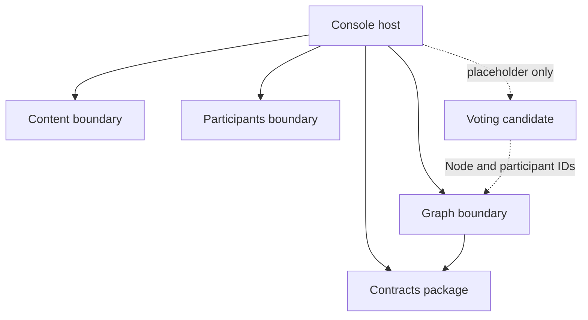
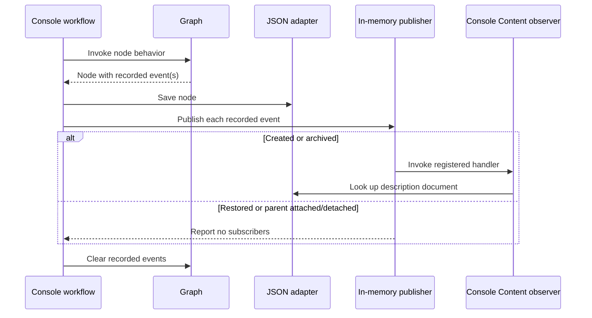

# Atlas current-state context map

This document is the authoritative inventory of Atlas boundaries, ownership, and communication as implemented today. It records evidence and gaps; it does not design the future architecture.

`Graph`, `Content`, and `Participants` are domain boundaries. `Contracts` is a shared integration-contract package, and `Console` is the current host/composition root. They appear together because all five participate in the running prototype, not because they are the same kind of architectural component.

## Current topology

Solid arrows are implemented project references or calls. Dashed arrows are documented candidates with no implemented boundary.

The final dashed relationship is documented intent, not a claim that Voting exists or that its design is settled.

## Boundary coverage matrix

“References” means an ID or public API used across an ownership boundary. Repository interfaces belong to the domain that defines its persistence needs; the JSON implementations belong to the Console host.

| Component | Kind | Current responsibility | Implemented behaviors | Owns | References | Does not own | Publishes | Subscribes | Existing documentation | Gaps or open questions |
|---|---|---|---|---|---|---|---|---|---|---|
| **Graph** | Domain boundary | Model typed nodes and the directed parent graph | Create/reconstitute nodes; rename; change type; replace description reference; archive/restore; request/stop requesting response types; attach/detach parents; create/edit/archive node types; enforce local invariants | Nodes, node IDs, node types, requested sub-node types, parent IDs on the child, Graph lifecycle state | `NodeAuthorId` corresponding to a Participant ID; `NodeDescriptionId` corresponding to a Document ID; Contracts event records | Profiles, credentials, documents, votes, JSON persistence | `NodeCreatedV1`, `NodeArchivedV1`, `NodeRestoredV1`, `NodeParentAttachedV1`, `NodeParentDetachedV1` are recorded on `Node` | None | [Graph README](../../src/Atlas.Graph/README.md); [requirements](../requirements/REQUIREMENTS.md); [RTM](../requirements/TRACEABILITY.md); ADRs 1–3 | Cycle prevention and default Comment policy are host-local; most node mutations lack authorization; relationship-node minimum-parent rule is not enforced; global type-name uniqueness is host-local; several mutations have no events; Graph directly references the shared Contracts project, and whether that dependency is the desired long-term direction remains an architectural question |
| **Content** | Domain boundary | Hold separately identified description documents | Create/reconstitute a document and normalize its initial text; define document repository needs | Documents, document IDs, document text, creation time | No foreign IDs in the current model | Nodes, profiles, votes, event dispatch, JSON persistence | None | None inside `Atlas.Content`; a Console-owned observer is registered for `NodeCreatedV1` and `NodeArchivedV1` and queries the Content repository | [data ownership](DATA-OWNERSHIP.md); [node lifecycle workflow](../workflows/NODE-LIFECYCLE.md); CON requirements and RTM rows | No document-edit behavior or updated timestamp; no Content tests; no application use case; observer placement makes “Content subscribes” conceptually true but structurally ambiguous; creation can leave an orphaned document |
| **Participants** | Domain boundary | Model public participant profiles and profile lifecycle | Create/reconstitute participant; update own display name and bio through an authorized use case; deactivate entity; query/save through repository contract | Participant IDs, display name, bio, active state, timestamps, self-edit policy | Nothing from Graph in its core model | Nodes/authored contributions, credentials/login tokens, documents, Graph authorization rules, JSON persistence | None | None | [Participants README](../../src/Atlas.Participants/README.md); PAR/AUT requirements and RTM rows | Deactivation is public and lacks an authorized use case; reactivation and moderator policy are undefined; no lifecycle events; profile browsing and authored-node composition live in Console |
| **Contracts** | Shared contract package | Supply versioned payload types used for cross-boundary messages | Define Graph V1 lifecycle record shapes | Payload definitions and version namespaces | Primitive wire values supplied by Graph | Domain rules, entities, event dispatch, persistence, consumer reactions | None by itself | None | [contracts catalog](../contracts/README.md); [ADR-0003](decisions/ADR-0003-use-versioned-integration-contracts.md) | No serialization compatibility tests; no event ID, correlation, or causation metadata; shared package is currently described beside bounded contexts even though it is not itself a domain boundary |
| **Console** | Host / composition root | Compose workflows and reads; provide the interactive UI, session actor, persistence adapters, seeding, and synchronous event dispatch | Create/browse participants and nodes; edit profiles; compose author/document/type data for display; check graph cycles; seed system types; save JSON; register and dispatch event handlers | Current-participant session state, host workflow sequencing, UI, JSON adapter implementations, in-memory subscriber registry | Public APIs and repository contracts from all implemented boundaries; Contracts payloads | Domain invariants, nodes, documents, profiles, contract meanings | Dispatches Graph-recorded events after saves; it is not the semantic event producer | Registers a Console-owned observer for `NodeCreatedV1` and `NodeArchivedV1` | [Console README](../../src/Atlas.Console/README.md); [node lifecycle workflow](../workflows/NODE-LIFECYCLE.md); EVT/PER requirements and RTM rows | Host contains policies that may belong behind boundary APIs; no transaction across document/node saves; no durable delivery, retries, idempotency, or failure isolation; handlers run synchronously and exceptions can interrupt dispatch; restore and parent events have no registered handlers |
| **Voting** | Candidate domain; not implemented | A vote total and average are displayed as placeholders | None | No current data | Candidate references to Node and Participant IDs are documented | Nodes, profiles, documents | None | None | VOT-001 in [requirements](../requirements/REQUIREMENTS.md) and [RTM](../requirements/TRACEABILITY.md); future row in [data ownership](DATA-OWNERSHIP.md) | Boundary, ballot model, rating scale, eligibility, aggregation, persistence, and events all require later design |

## Implemented event flow

| Event | Semantic producer | Recorded by | Dispatched by | Registered subscriber | Current reaction |
|---|---|---|---|---|---|
| `NodeCreatedV1` | Graph | `Node` constructor | Console after node save | `ObserveNodeLifecycleInContent` in Console | Log receipt and confirm the referenced document exists |
| `NodeArchivedV1` | Graph | `Node.Archive` | Console after node save | `ObserveNodeLifecycleInContent` in Console | Log receipt, confirm the document exists, and make no Content state change |
| `NodeRestoredV1` | Graph | `Node.Restore` | Console after node save | None | Publisher logs that no subscriber accepted it |
| `NodeParentAttachedV1` | Graph | `Node.AttachToParent` | Console after node save | None | Publisher logs that no subscriber accepted it |
| `NodeParentDetachedV1` | Graph | `Node.DetachFromParent` | Console after node save | None | Publisher logs that no subscriber accepted it |

Graph records the facts but does not dispatch them. The Console publishes them synchronously only along the workflows that explicitly call its publishing helper. Reconstituted nodes do not recreate past events.

## Existing cross-boundary workflows

| Workflow | Boundaries/components involved | Current coordination | Known failure or ownership gap |
|---|---|---|---|
| Create node with description | Console, Content, Graph, Contracts | Console saves a new Content document, constructs and saves the Graph node with its ID, then dispatches recorded events | A failed node creation/save can leave an orphaned document; no transaction or compensation |
| Display node | Console, Graph, Content, Participants | Console joins records in memory using description and author GUID values | Missing references are presentation concerns; no explicit cross-boundary read model or missing-reference policy |
| Edit participant profile | Console, Participants | Console calls `UpdateParticipantProfile`, which authorizes self-edit and persists through the Participants repository | This protected route exists for profiles but not for most Graph mutations |
| Add or link sub-node | Console, Graph | Console traverses loaded nodes to reject cycles, invokes Graph behavior, saves, then dispatches events | Cycle invariant is not guaranteed for another host; relationship-node cardinality is not enforced |
| Seed system node types | Console, Graph | Console creates or adjusts well-known types at startup | Stable semantic identity and global uniqueness are not enforced by Graph |

## Documentation authority and overlap

| Document | Authoritative purpose | PTT-68 finding |
|---|---|---|
| **This context map** | Boundary/component inventory, responsibilities, ownership summary, relationships, event flow, and current gaps | Keep as the single architectural overview. Do not create a second boundary-definition document for PTT-68. |
| [Data ownership](DATA-OWNERSHIP.md) | Record-level authority, ID generation, storage location, and consistency rules | Keep as the detailed ownership register. It should link here instead of redefining whole boundary responsibilities. |
| [Requirements](../requirements/REQUIREMENTS.md) | Committed/proposed behavior and acceptance criteria | Keep; it describes intent, not proof that behavior exists. |
| [Traceability](../requirements/TRACEABILITY.md) | Requirement-to-code/test evidence and requirement-level gaps | Keep; some gap text overlaps this map and should be linked when practical rather than independently expanded. |
| [Contracts catalog](../contracts/README.md) | Payload catalog, producer/consumer meaning, and compatibility policy | Keep; C# records remain the executable payload definitions. Correct the “known consumer” language if the observer remains host-owned. |
| [Node lifecycle workflow](../workflows/NODE-LIFECYCLE.md) | Cross-boundary sequence, persistence result, and failure path | Keep; update when workflow sequencing changes. |
| Boundary project READMEs | Boundary-specific model and implementation detail | Keep; they provide depth, but responsibility summaries should agree with this map. |
| ADRs | Rationale for accepted architectural decisions | Keep immutable; supersede with a new ADR when a decision changes. |

## Gap summary for PTT-65

### Current boundary-integrity gaps

1. Several Graph-wide rules are enforced only by the Console: cycle prevention, default Comment requests, type-name uniqueness, and parts of parent selection.
2. Graph records versioned contract objects directly and therefore references `Atlas.Contracts`. The documents describe this as intentional, but the direction and distinction between domain events and integration events should be confirmed before extraction.
3. Content's only event reaction is implemented in the Console project. The handler demonstrates decoupling, but its ownership and name imply a boundary subscription that `Atlas.Content` does not actually contain.
4. The host performs non-atomic cross-boundary creation. An orphaned document is possible, and event delivery is not durable.
5. Participants protects profile edits at an application boundary, while Graph mutations generally lack an equivalent authorized application layer.
6. `AuthorId` and `DescriptionId` correspond by GUID convention, but reference validation and missing-reference behavior are not consistently defined.
7. Documentation sometimes calls Graph-recorded contract records “domain events” and elsewhere “integration events.” The lifecycle and translation point between those concepts are not explicit.

### Incomplete existing boundaries

- **Graph:** relationship semantics, link metadata/history, query services, mutation events, archive effects, and boundary-owned multi-aggregate rules.
- **Content:** editing, rich/block content, lifecycle policy, tests, and application-level operations.
- **Participants:** protected deactivation, reactivation, moderator rules, authentication integration, and participant events.
- **Contracts/eventing:** compatibility tests, metadata, reliable delivery, retries, idempotency, and consumer failure handling.

### Candidate future domains discovered

These are discoveries only, not designs:

- Voting is already represented by an approved requirement and Console placeholders.
- Search, Activity, Notifications, and Analytics are named as potential consumers in ADR-0003 but have no current boundary or implementation.
- Authentication/identity is explicitly outside Participants, but no owning Atlas component is identified.
- Moderation is referenced by node-type policy and future authorization needs, but no boundary is implemented.

See [Data ownership](DATA-OWNERSHIP.md) for the record-level authority table and [ADRs](decisions/README.md) for the reasoning behind existing choices.
