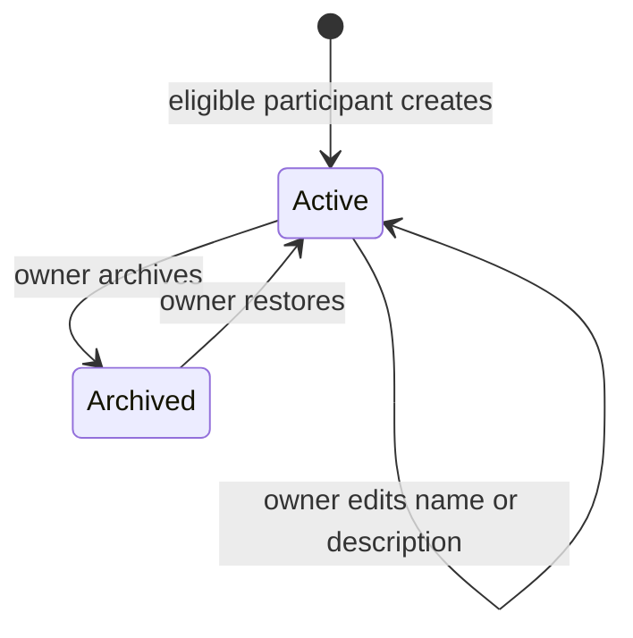
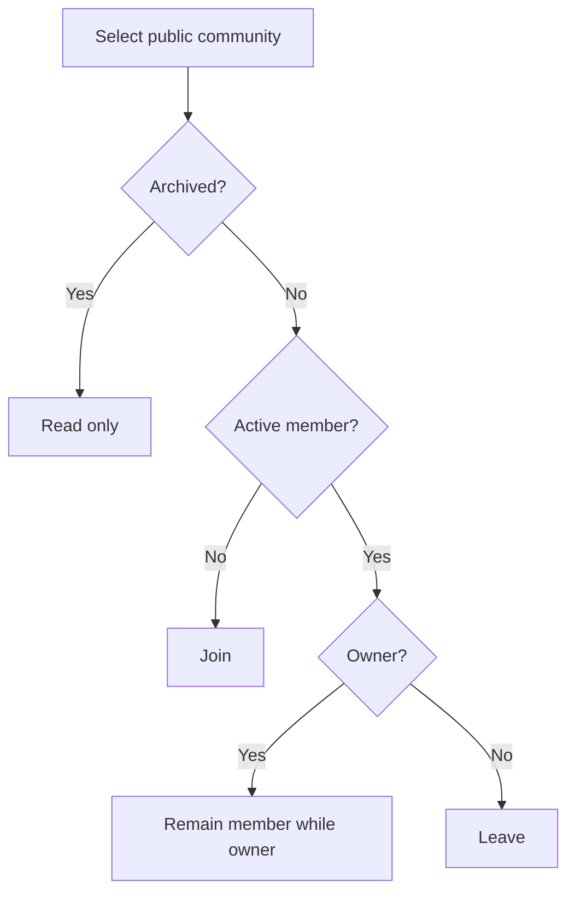
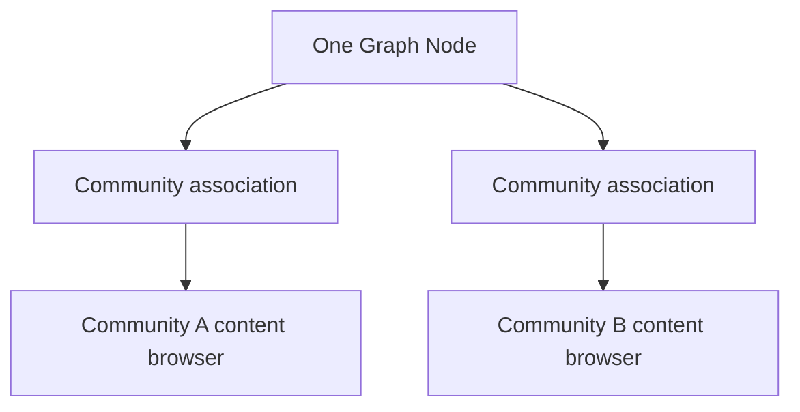

# Communities workflows

[Boundary](../architecture/COMMUNITIES.md) · [Requirements](../requirements/REQUIREMENTS.md#communities) · [Traceability](../requirements/TRACEABILITY.md#com-001)

## Community lifecycle

Creation also establishes the creator as owner and first active member. Archived Communities remain readable but reject joins and new Node associations.

## Membership decision

## Node organization and navigation

A Node may have no associations. Multiple associations still point to one Node and do not create, copy, attach, or detach Graph parent relationships. The Console shows Communities next to tags, lets a participant manage associations from a Node, and supports navigation in both directions.
