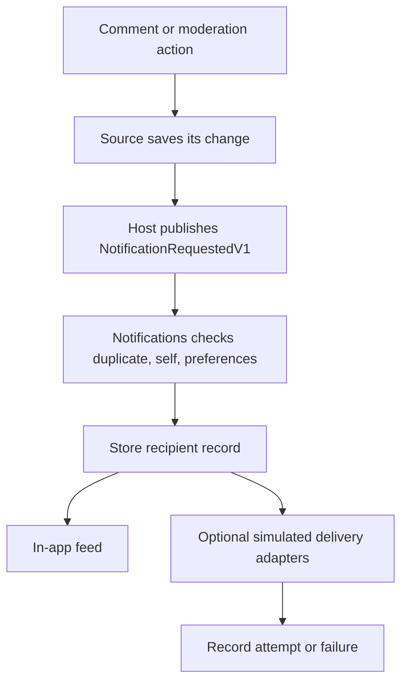

# Notifications workflow

The console dispatch is currently synchronous. The intended durable event delivery is a follow-up; see [boundary and requirements](../architecture/NOTIFICATIONS.md).

[Open the editable Notifications Blackboard](../blackboards/workflows/Notifications/NotificationsDomain.excalidraw) for the current console workflow and ownership boundaries.

[Open the event bus Blackboard](../blackboards/workflows/System/InMemoryEventBus.excalidraw) to see how the console registers and dispatches notification requests.
