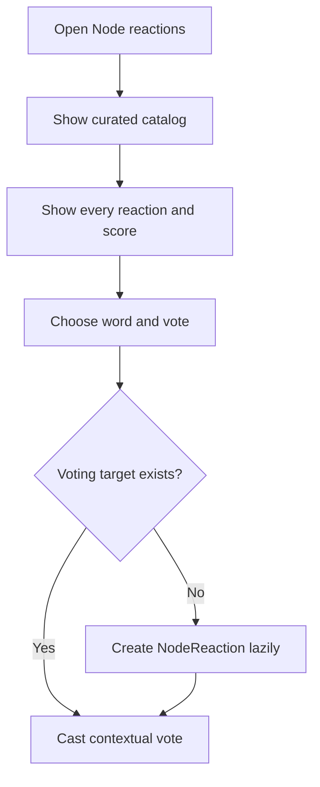
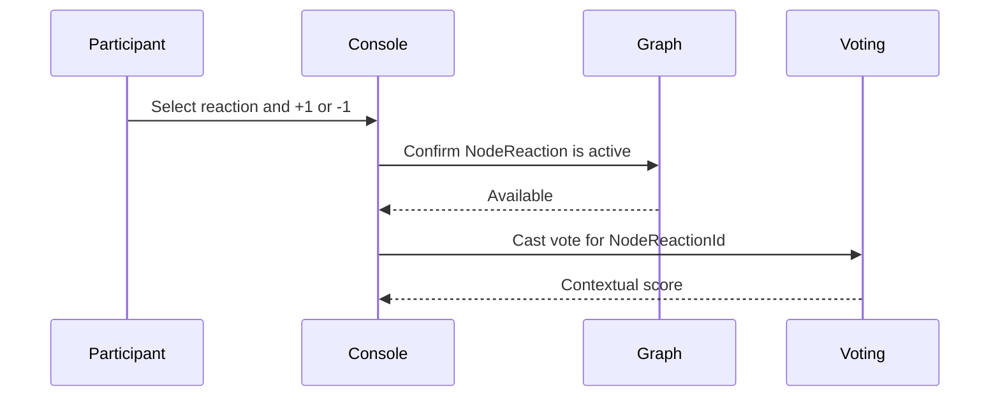

# Curated Node Reactions

Reactions are short expressions of how a participant responds to a Node in context. They are deliberately different from topics, categories, and the Node's 0–10 rating.

| Concept | Meaning |
|---|---|
| Node rating | A participant's 0–10 resonance with the Node itself |
| Reaction | A curated word and emoji applied to one Node |
| Reaction vote | +1 or −1 indicating whether that word resonates in the context of that Node |
| Reaction catalog | The complete curated vocabulary available to every Node |
| Node reaction | A lazily created voting target for one Node and one ReactionDefinition |

Examples include `🌱 Promising`, `❗ Important`, `🚨 Urgent`, `⚠️ Concerning`, and `🔎 Evidence-needed`. Topic phrases such as “Native plants,” “Pollinator habitat,” and “Safe routes” belong in Nodes or Communities rather than the reaction catalog.

## Add a reaction

Participants cannot create reaction wording through the Node workflow. Graph owns the catalog and the Node–Reaction association. The association is created only when the first vote is cast. Applying the same definition to different Nodes creates independent `NodeReactionId` targets.

## Vote on a reaction

Voting owns one current signed vote per participant and `NodeReactionId`. A positive vote means the expression fits or resonates in context; a negative vote means it does not. It never changes the Node's separate 0–10 rating.

## Lifecycle and presentation

- Active participants may vote on any catalog reaction for an active Node.
- The same catalog entry can appear only once on a Node.
- Archived Nodes preserve reactions and votes for reading but reject mutation.
- Curated wording removes the normal need for typo replacement, author hiding, disputes, and global suppression in the participant-facing workflow.
- The picker shows every catalog reaction, including zero-score choices.
- Compact and detail views show only reactions with votes, using one unified Reactions presentation.
