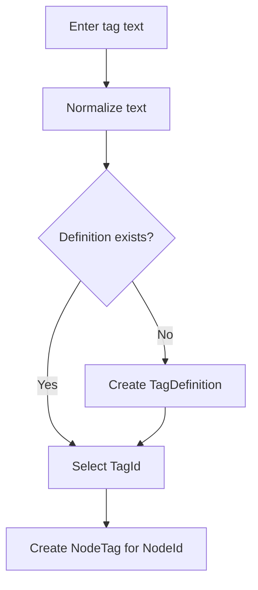
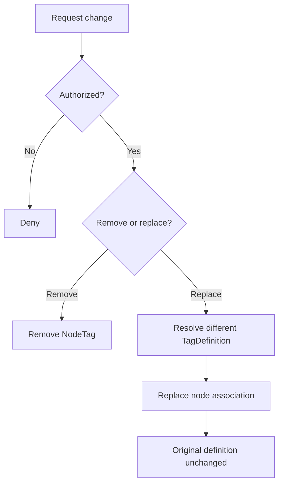
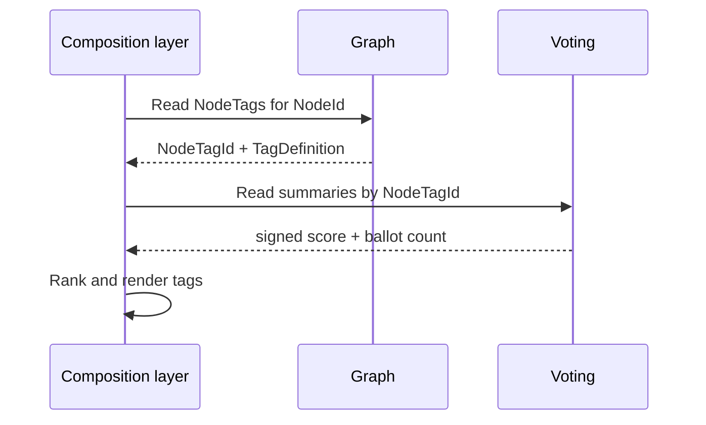

# Reusable node tags

This workflow defines the approved behavior for reusable tags before implementation. The authoritative requirements are [TAG-001 through TAG-009](../requirements/REQUIREMENTS.md#tag-001).

## Ownership

| Concern | Owner |
|---|---|
| `TagDefinition` vocabulary and normalization | Graph |
| `NodeTag` application and lifecycle | Graph |
| Participant eligibility and moderator capabilities | Participants/Authorization through identifier-based ports |
| Ballots and summaries targeting a `NodeTagId` | Voting |
| Joining tags with vote summaries for display | Application composition layer |

Graph does not store or cache an authoritative vote summary. Voting does not own tag wording or decide which tag associations exist.

## Definition reuse and application

The actor must be active, the node must be active, and the node must not already have an active association to the selected definition. These steps satisfy [TAG-001](../requirements/REQUIREMENTS.md#tag-001), [TAG-002](../requirements/REQUIREMENTS.md#tag-002), [TAG-003](../requirements/REQUIREMENTS.md#tag-003), and [TAG-007](../requirements/REQUIREMENTS.md#tag-007).

## Normalization baseline

Normalization is deterministic and occurs before lookup or creation:

1. Trim leading and trailing whitespace.
2. Collapse each internal whitespace run to one space.
3. Apply Unicode compatibility normalization.
4. Compare normalized values case-insensitively.

The original cleaned text remains the presentation form. Punctuation is significant. Database persistence must enforce normalized uniqueness atomically so concurrent creation cannot produce duplicates.

## Replace or remove a tag

A node-level edit never renames a shared definition. Replacement resolves a different definition and changes only that node's association. See [TAG-004](../requirements/REQUIREMENTS.md#tag-004) and [TAG-005](../requirements/REQUIREMENTS.md#tag-005).

## Permissions and moderation baseline

- Any active participant may apply a tag to an active node.
- The applying participant may withdraw or replace their own association.
- The node author may endorse, hide, or dispute an association but cannot erase a community contribution.
- A moderator must hold an explicit tag-moderation capability to remove another participant's association or suppress a definition.
- Suppressing a definition makes its associations unavailable for new activity without deleting historical identity or vote summaries.
- Archived nodes are readable but reject tag mutations.

## Lifecycle and author disposition

`NodeTag` records two independent decisions. Lifecycle records whether the association is active and why it ended: `Active`, `Withdrawn`, `Superseded`, or `AdministrativelyRemoved`. Disposition records how the node author presents an active association: `Community`, `Endorsed`, `Hidden`, or `Disputed`.

Hidden and disputed associations remain available through an explicit review view. A dispute is also the future handoff point to Moderation; this slice records the state but does not pretend the Moderation boundary already exists. Ordinary actions retain the original association, proposer, and timestamps for audit.

## Graph-to-Voting interaction

A NodeTag vote evaluates whether one tag characterizes one node. Voting therefore targets `NodeTagId`, never the reusable `TagId`. Casting, changing, and undoing remain Voting-owned behavior. Graph supplies target availability through an identifier-based port; Voting does not load Graph entities. See [TAG-008](../requirements/REQUIREMENTS.md#tag-008).

## Presentation baseline

Compact node cards show at most three tags. The composition layer ranks active associations by:

1. Highest net signed score.
2. Highest total ballot count.
3. Oldest association creation time.
4. `NodeTagId` as a stable final tie-break.

The node detail view exposes the complete tag set. This is presentation logic over Graph and Voting reads, not Graph-owned state. See [TAG-009](../requirements/REQUIREMENTS.md#tag-009).

## Failure outcomes

| Condition | Outcome |
|---|---|
| Empty normalized text | Reject definition creation |
| Equivalent definition exists | Return/select the existing definition |
| Same definition already applied to node | Return the existing association; do not duplicate |
| Participant inactive | Reject application or vote |
| Node archived | Preserve reads; reject tag mutation and voting |
| NodeTag suppressed or removed | Preserve history; reject new voting |
| Definition lookup unavailable | Report failure; do not create speculatively |
| Concurrent duplicate definition/application | Persistence uniqueness resolves to one record |

## Follow-up implementation slices

- [PTT-88](https://thepublicthinktank.atlassian.net/browse/PTT-88): implement the combined Graph, persistence, autocomplete, and display vertical slice.
- [PTT-90](https://thepublicthinktank.atlassian.net/browse/PTT-90): extend Voting with a signed `NodeTagId` target and target-availability adapter.
- [PTT-89](https://thepublicthinktank.atlassian.net/browse/PTT-89): combined into PTT-88; vote-based prominence remains in PTT-90.

These are implementation slices, not evidence that PTT-74's approved requirements are already implemented.
