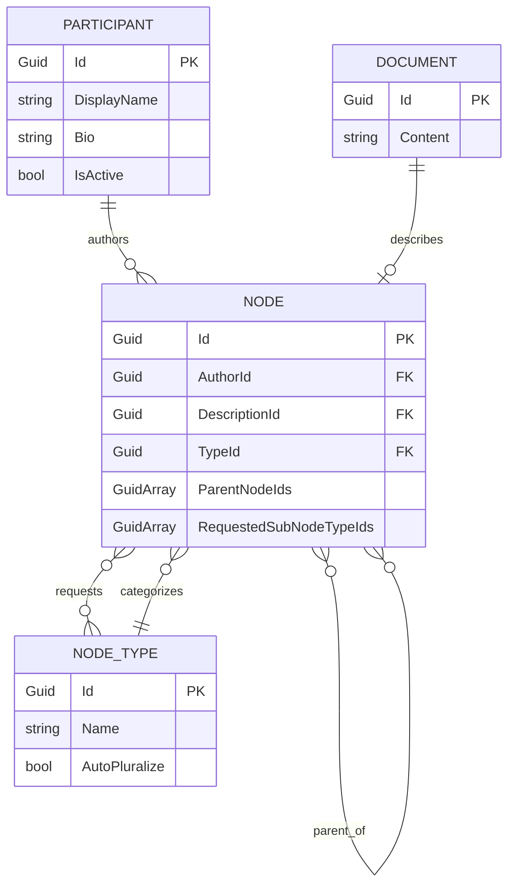
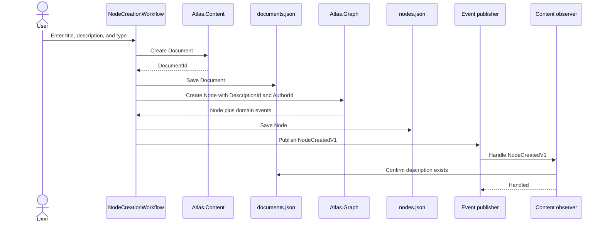
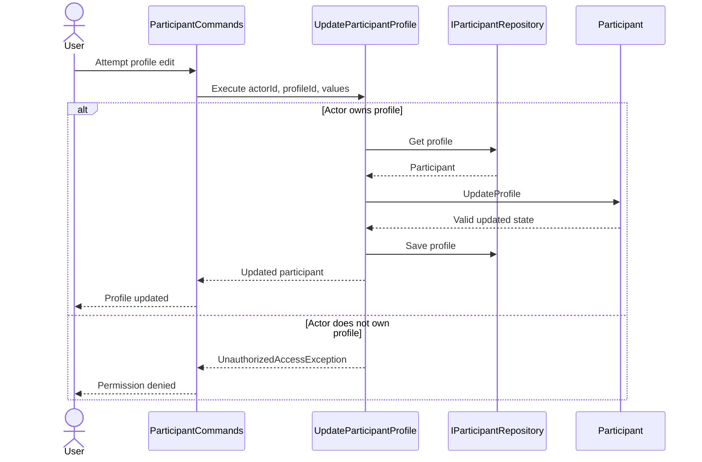
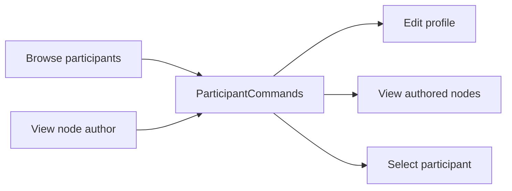

# Atlas.Console architecture

`Atlas.Console` is the executable host and composition root for the current Atlas prototype. It stitches the domain boundaries together, supplies JSON-backed repository implementations, presents interactive workflows, and dispatches integration events synchronously in memory.

The projects are strongly separated domain boundaries inside one process today. They are not independently deployed microservices yet.

## The overall composition

```mermaid
flowchart TB
    user["Console user"]

    subgraph host["Atlas.Console host"]
        program["Program.cs — composition root"]
        app["ConsoleApplication — main menu and session"]
        workflows["Console workflows — nodes and profiles"]
        eventBus["In-memory event publisher"]
        adapters["JSON repository adapters"]
    end

    subgraph boundaries["Domain boundaries"]
        graph["Atlas.Graph — nodes and node types"]
        content["Atlas.Content — description documents"]
        participants["Atlas.Participants — profiles and profile authorization"]
        contracts["Atlas.Contracts — integration-event payloads"]
    end

    subgraph storage["File-system data"]
        files["data/*.json"]
    end

    user --> app
    program --> app
    program --> eventBus
    program --> adapters
    app --> workflows
    workflows --> graph
    workflows --> content
    workflows --> participants
    graph --> contracts
    eventBus --> contracts
    eventBus --> content
    adapters --> graph
    adapters --> content
    adapters --> participants
    adapters --> files
```

`Program.cs` constructs the repositories, seeds system node types, registers event subscribers, selects the initial participant, and starts `ConsoleApplication`.

`ConsoleApplication` owns the current Console session, including the currently selected participant. It delegates focused work to classes such as `NodeCreationWorkflow`, `NodeCommands`, and `ParticipantCommands`.

## How the domain objects relate



The arrows describe relationships between identifiers, not C# object ownership:

- A Graph `Node` stores `AuthorId`; it does not contain an Atlas.Participants `Participant`.
- A Graph `Node` stores `DescriptionId`; it does not contain an Atlas.Content `Document`.
- A node's `ParentNodeIds` permit zero, one, or multiple parents.
- Requested sub-node types are invitations for future contributions. Removing a requested type does not remove existing child nodes.
- The Console creates combined read models for tables by querying multiple repositories.

## Node creation across boundaries



Content generates the document ID because Content owns the document lifecycle. Graph receives only that opaque identifier. The node is saved before its recorded events are published.

The current publisher and subscribers are synchronous and in-process. A future message broker and outbox could replace this infrastructure without putting broker code inside the domain objects.

## Participant profile authorization



Selecting a participant in the Console simulates authentication: it establishes who the current actor is. `UpdateParticipantProfile` in Atlas.Participants performs authorization by comparing the actor ID with the profile ID. `Participant.UpdateProfile` validates and applies the state change atomically.

Both entry paths use the same `ParticipantCommands` workflow:



This is why editing another participant remains visible: the Console allows the attempt so the Participants boundary can demonstrate and enforce the permission rule.

## Persistence adapters

| Domain contract | Console implementation | File |
|---|---|---|
| `INodeRepository` | `JsonNodeRepository` | `data/nodes.json` |
| `INodeTypeRepository` | `JsonNodeTypeRepository` | `data/node-types.json` |
| `IDocumentRepository` | `JsonDocumentRepository` | `data/documents.json` |
| `IParticipantRepository` | `JsonParticipantRepository` | `data/participants.json` |

The repository interfaces live with the boundaries that own their data. The JSON implementations live in Atlas.Console because file storage is infrastructure for this prototype.

## Where to begin reading the code

1. `Program.cs` — how the application is assembled.
2. `ConsoleApplication.cs` — the main menu and current-participant session.
3. `NodeCreationWorkflow.cs` — coordination across Content, Graph, storage, and events.
4. `NodeCommands.cs` — detailed-node actions and navigation.
5. `Participants/ParticipantCommands.cs` — shared profile actions and authorization call.
6. `Eventing/InMemoryEventPublisher.cs` — subscriber registration and synchronous dispatch.
7. `Content/ObserveNodeLifecycleInContent.cs` — how Content observes Graph events.
8. `Storage/` — how domain objects are translated to and from JSON records.

## Current architectural boundaries

The Console is intentionally doing several application-layer jobs while it is the only executable host. When an MVC or API host is added, reusable use cases should move out of Console rather than be copied. Presentation stays in each host; domain rules, application authorization, contracts, and persistence abstractions remain reusable.
