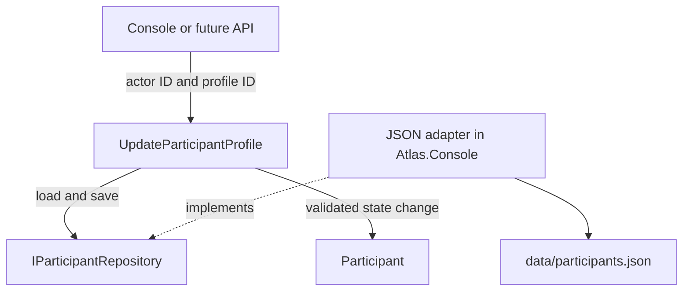
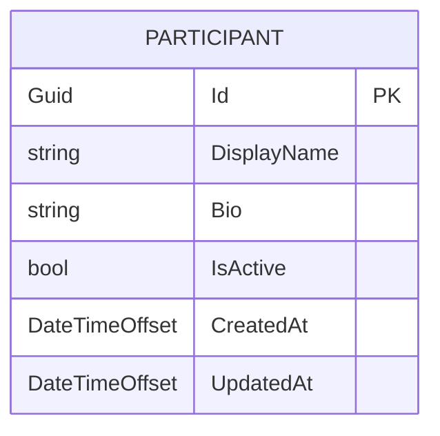
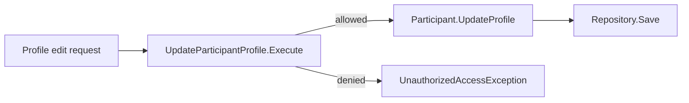
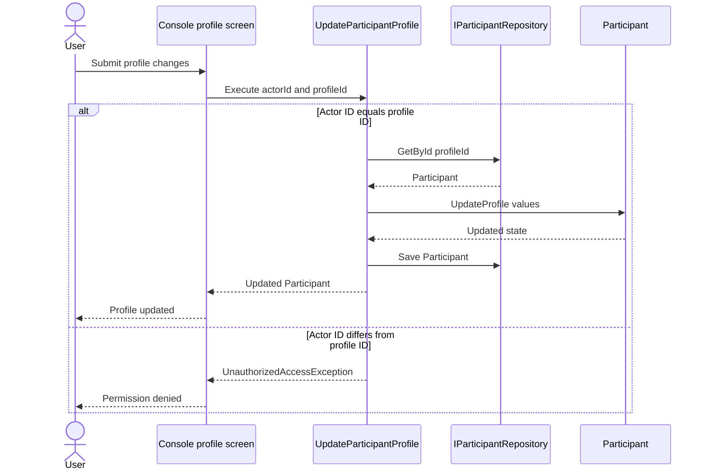
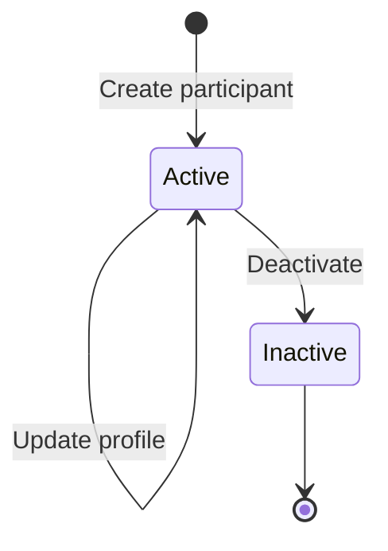
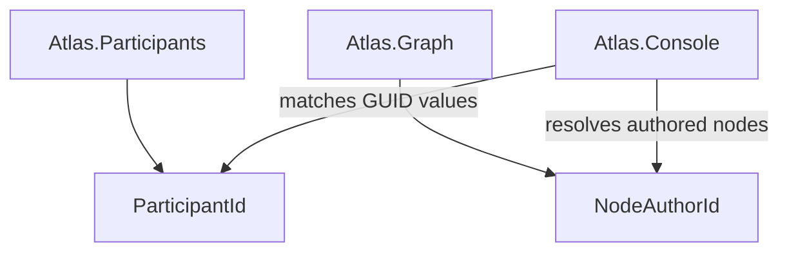

# Atlas.Participants

`Atlas.Participants` owns Atlas participant profiles and participant lifecycle behavior. It currently models a participant's identifier, display name, biography, active status, timestamps, persistence contract, and the protected profile-update use case.

It does not authenticate credentials, issue login tokens, own Graph nodes, or contain Graph objects.

## Boundary at a glance



The interface `IParticipantRepository` belongs to Atlas.Participants because this boundary defines what it needs from persistence. The current `JsonParticipantRepository` implementation belongs to Atlas.Console because JSON storage is infrastructure for the prototype.

## Participant model



The current rules are:

- `ParticipantId` cannot contain an empty GUID.
- Display name is required, trimmed, and limited to 80 characters.
- Bio is optional, trimmed, and limited to 500 characters.
- New participants begin active.
- Creation and update timestamps initially match.
- A profile update validates both values before changing either one.
- Repeating an identical update does not change `UpdatedAt`.
- Reconstituting persisted data cannot place `UpdatedAt` before `CreatedAt`.

## Entity behavior versus protected use case

These two operations deliberately answer different questions:



### `Participant.UpdateProfile`

The entity method answers:

> Given a valid profile change, how should this Participant change?

It validates the display name and bio, changes them together, and updates the timestamp. It does not know who is signed in.

### `UpdateParticipantProfile.Execute`

The application use case answers:

> May this actor edit this profile, and how is the complete operation performed?

It receives both identifiers:

```csharp
workflow.Execute(
    currentParticipant.Id, // actorId
    participant.Id,        // profileId
    displayName,
    bio,
    changedAt);
```

It checks permission, loads the profile, invokes the entity behavior, saves the result, and returns the updated participant.

## Permission sequence



The Console's selected participant simulates the authenticated actor. Atlas.Participants performs the authorization check for this Participants-owned operation.

A future MVC application could obtain the actor ID from ASP.NET Core Identity, but it should call the same protected use case rather than duplicating the ownership check in a controller.

## Participant lifecycle



Reactivation has not been defined yet. Deactivation currently changes the state and timestamp but does not yet have a protected application use case or integration event.

## Relationships with other boundaries



Graph does not contain a `Participant`. A Graph `Node` stores its own `NodeAuthorId`, whose GUID corresponds to a Participants-owned `ParticipantId`. The Console combines the two boundaries when it displays an author name, profile, or authored-node totals.

This preserves independent domain models while allowing the host to compose a user-facing view.

## Current Console demonstration

Both of these paths enter the same `ParticipantCommands` profile workflow:

- Main menu → Browse participants → Select profile
- Browse nodes → Open node → View author profile

The shared profile workflow offers:

1. Edit profile
2. View authored nodes
3. Select as current participant
4. Return

The Edit action remains visible for someone else's profile so the authorization rejection can be observed. Hiding the action in a future UI may improve usability, but server-side or application-layer authorization must remain even if the UI hides it.

## Enforced profile-update route

The profile-content mutation methods `Rename`, `ChangeBio`, and `UpdateProfile` are internal to Atlas.Participants. External hosts cannot call them directly and bypass the ownership check.

The enforced compile-time route is:

```text
External host → UpdateParticipantProfile → Participant.UpdateProfile
```

`UpdateParticipantProfile.Execute()` remains public. It checks that the actor owns the target profile before invoking the internal entity behavior.

The test assembly receives explicit internal visibility through `InternalsVisibleTo`. This keeps low-level domain behavior directly testable without exposing it to Console or future API hosts.

`Deactivate()` remains public for now because protected deactivation has not yet been designed. It should receive its own application use case before user-facing deactivation is exposed.

## Tests

`tests/Atlas.Participants.Tests` currently covers:

- Profile creation and defaults
- Display name and bio normalization
- Bio maximum length
- Atomic profile updates
- No-op timestamp behavior
- Reconstitution
- Successful self-edit authorization
- Rejected edits of another participant
- Missing-profile behavior

Future tests should cover protected deactivation, any reactivation policy, participant events, moderator permissions, and persistence round trips.

## Suggested reading order

1. `Participants/ParticipantId.cs`
2. `Participants/Participant.cs`
3. `Participants/IParticipantRepository.cs`
4. `Profiles/UpdateParticipantProfile.cs`
5. `../../tests/Atlas.Participants.Tests/`
6. `../Atlas.Console/Participants/ParticipantCommands.cs`
7. `../Atlas.Console/Storage/JsonParticipantRepository.cs`
